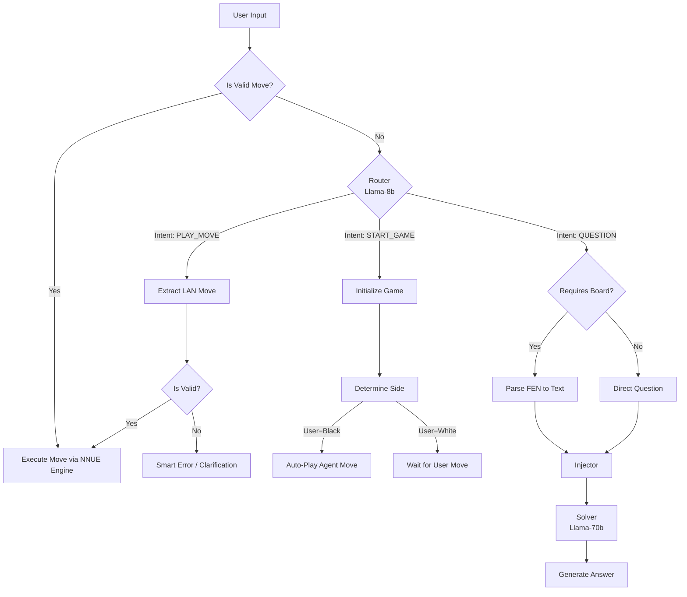

# NNUE Chess Chatbot Web Interface

A modern, interactive web interface for the Neural Network Updated Evaluation (NNUE) ChessBot.

## Deployment

- **Frontend**: Combell

Available at: https://l145.be/nnue-chessbot

## Features

- **Interactive Chat Interface**: Talk to the bot, ask chess questions, or command it to start games.
- **Custom Chess Board**: A lightweight, custom-built React chessboard that renders FEN states dynamically.
- **Start Game Cards**: Quick actions to start a game as White, Black, or Random side directly from the empty state.
- **Preset Questions**: One-click common chess questions to demonstrate the bot's knowledge.
- **State Management**: Uses **TanStack Query** for efficient server state management.
- **AI Integration**: Powered by **Groq** for conversational capabilities.
- **Responsive Design**: Fully responsive UI with a premium, dark-themed aesthetic.
- **Reset Functionality**: Click the Rook icon (top-left) to instantly reset the chat and game state.

## Agentic Architecture

The chatbot operates on a prioritized decision workflow:

0.  **Direct Play (NNUE Engine)**:
    - _Priority Check_: The system first checks if the input is a valid chess move (e.g., `e2e4`, `Nf3`).
    - If valid, it **bypasses the LLM entirely** and executes the move directly against the custom NNUE engine for maximum speed.
1.  **Router (Llama-3.1-8b-instant)**:
    - If not a move, the Router classifies intent: `START_GAME` or `QUESTION` or `PLAY_MOVE`.
    - `PLAY_MOVE`: decodes to a LAN move if possible, handles errors gracefully.
    - `START_GAME`: Determines which side the user wants to play or if the question requires board context.
    - `QUESTION`: The system prompts a more capable model to answer, injecting board state if needed.
2.  **Solver (Llama-3.3-70b-versatile)**:
    - If `QUESTION`: The system prompts a more capable model to answer, injecting board state if needed.

### Workflow Diagram



## Tech Stack

- **Framework**: [Astro](https://astro.build/) (Static Site Generation)
- **UI Library**: [React](https://reactjs.org/)
- **State Management**: [TanStack Query (React Query)](https://tanstack.com/query/latest)
- **Styling**: Vanilla CSS, Scoped CSS Modules
- **LLM Provider**: [Groq](https://groq.com/) (Managed by Python Backend)
- **Server**: [FastAPI](https://fastapi.tiangolo.com/) (Python) - Handles logic, LLM, and Engine

## Project Structure

- `src/components/`: React components (`ChatInterface`, `ChessBoard`).
- `src/layouts/`: Astro layouts (`Layout.astro`).
- `src/pages/`: Astro pages (Static).
- `src/utils/`: Utilities (`fenParser.ts`).
- `src/styles/`: Global and shared styles.

## Getting Started

### Prerequisites

- Node.js (v18+)
- Python 3.6+ (for the backend engine)
- API Key (Groq)

### Configuration

Create a `.env` file in the **root** directory (not `chatbot/`) with your Groq API Key, as it is now used by the Python backend:

```env
GROQ_API_KEY=gsk_your_key_here
```

> [!TIP]
> You can get a free Groq API key at [https://console.groq.com/keys](https://console.groq.com/keys).

### Running the Application

You can start the entire stack (web interface + python engine) using the provided PowerShell script in the root directory:

```powershell
# From the project root
.\chess_bot_web.ps1
```

Or run them manually:

1.  **Web Interface**:

    ```bash
    cd chatbot
    npm install
    npm run dev
    ```

2.  **Backend Engine**:
    ```bash
    # From project root
    python -m server.main
    ```

Access the web interface at `http://localhost:4321`.
