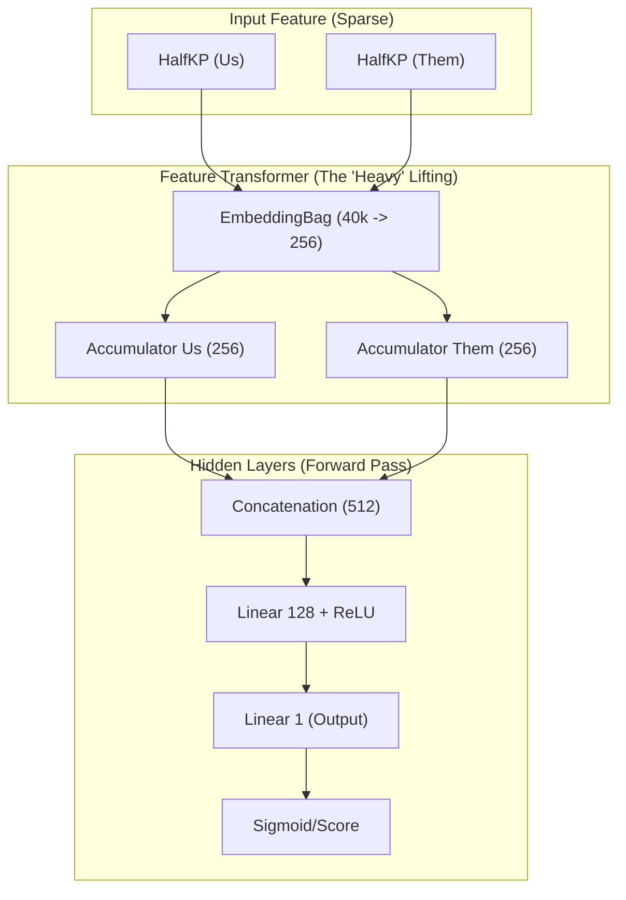
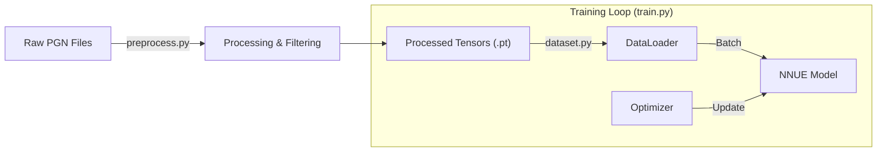
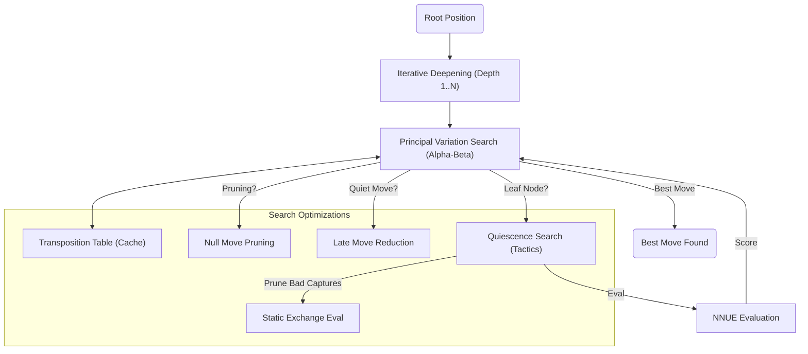

# Chess Engines

This directory contains the chess engines used by the bot.

## NNUE Bot (`engines/bot`)

This is a custom chess engine powered by an NNUE (Efficiently Updatable Neural Network) architecture. It evaluates board positions to select the best move.

### Deployment

**Backend**: Azure VM (Containerized w/ Docker)

### Architecture

The model uses a standard NNUE architecture with **HalfKP** features:

1.  **Input**:
    - **HalfKP Features**: The board is represented by the interaction between the friendly King and every other piece on the board.
    - **Feature Indexing**: `KingSquare * 640 + PieceSquare * 10 + PieceType`.
    - Total features: ~41k sparse inputs per perspective.

2.  **Feature Transformer**:
    - **EmbeddingBag**: Efficiently sums the weights of active features.
    - Projects the sparse input into a dense 256-dimensional vector for each perspective ("us" and "them").

3.  **Network Layers**:
    - **Input**: Concatenation of the two 256-dim accumulators (512 inputs).
    - **Hidden Layers**: 512 -> 128 -> 1.
    - **Output**: 1 neuron (Evaluation score).
    - **Activation**: `ReLU` (Standard Rectified Linear Unit).

### Features

- **NNUE Architecture**: Efficiently Updatable Neural Network for fast evaluation.
- **Dual Accumulators**: Maintains and updates feature accumulators for both White and Black perspectives incrementally.
- **Incremental Updates**: Calculates feature deltas (added/removed pieces) to update the accumulator instead of recomputing from scratch.
- **Advanced Search Engine**:
  - **Principal Variation Search (PVS)**: A NegaScout variant to optimize alpha-beta search windows.
  - **Null Move Pruning (NMP)**: Prunes subtrees where passing the move is still too good for the opponent.
  - **Late Move Reductions (LMR)**: Reduces search depth for quiet moves late in the move order.
  - **MVV-LVA Move Ordering**: Prioritizes capturing valuable pieces with less valuable ones.
  - **Static Exchange Evaluation (SEE)**: Filters out losing captures in Quiescence Search to save time.
  - **History & Killer Heuristics**: Guidelines to improved move ordering based on past search results.
  - **Transposition Table**: Zobrist Hashing to cache and retrieve search results.
  - **Check Extensions**: Extends search depth when in check.
  - **Iterative Deepening**: Searches incrementally (Depth 1, 2... N) for better time management and ordering.
- **Endgame Logic**:
  - **Mop-up Evaluation**: Incentivizes driving the enemy king to the edge and closing distance in winning positions.
  - **Pawn Incentives**: Bonuses for advancing pawns towards promotion in winning endgames.
- **Preprocessed Data**: Uses a compressed sparse row format for efficient data loading during training.

### Files

- **`dataset.py`**: Handles data loading.
  - `PreprocessedDataset`: Loads precomputed features/labels from `.pt` chunks.
  - `get_halfkp_features`: Computes HalfKP feature indices.
  - `get_feature_deltas`: Computes incremental changes for a move.
- **`model.py`**: Defines the `NNUE` PyTorch model.
  - `NNUE`: The main model class.
  - `update_accumulator`: Efficiently updates the feature transformer state.
- **`preprocess.py`**: Converts PGN games into efficient preprocessed chunks.
  - Scans `data/elite_data` for all `.pgn` files and processes them.
- **`train.py`**: Training script.
  - Uses `PreprocessedDataset` to train the model on the precomputed data.
  - Saves the model to `engines/bot/model/mlp_model.pth`.
- **`search.py`**: The core search engine implementation.
  - `Searcher`: Class containing the PVS search logic, TT, and heuristics.
- **`main.py`**: The interface entry point.
  - Wraps `search.py` to provide a simple `get_move(board)` API.

### How it works

This focuses on how the bot engine works.

#### 1. Network Architecture

The brain of the engine is a standard NNUE (Efficiently Updatable Neural Network) model. It is a shallow, dense network optimized for extremely fast inference on the CPU.



#### 2. Data Pipeline

How raw chess games become tensors for the neural network.



#### 3. Search Logic

How the bot decides which move to make in real-time.



### Usage

1.  **Data Preparation**:
    Place your PGN files in `data/elite_data`. The system is designed to handle multiple large PGN files.

    #### Data Processing (Optional, only works with 1 PGN file):

    If you have only 1 pgn file, put it in `data/`. Rename that PGN file to `lichess_db_raw.pgn`.

    If you want to filter by good games only (elo >2100 and time >180s), use the high-performance C# tool in `data/process_data` to filter it. Find more information in [data/process_data/README.md](../data/process_data/README.md).

    Navigate to `data/process_data` and run:

    ```bash
    dotnet run -c Release
    ```

    This creates `data/elite_data/lichess_db.pgn`.

2.  **Preprocessing**:
    To preprocess the PGN data into training chunks, run:

    ```bash
    python -m engines.bot.preprocess
    ```

    This will create a directory `data/processed_chunks` containing the preprocessed data.

3.  **Training**:
    To retrain the model, run:

    ```bash
    python -m engines.bot.train
    ```

    This saves the trained model to `engines/bot/model/mlp_model.pth`.

4.  **Running the Bot**:
    The bot is integrated into `homemade.py`. You can start it using the provided PowerShell script:
    - **PowerShell**:

    ```powershell
    pwsh start_bot.ps1
    ```

    - **Bash**:

    ```bash
    ./start_bot.sh
    ```

    This script sets up the environment and runs `lichess-bot.py`.

### Requirements

- Python 3.x
- `torch` (with CUDA recommended for training, CPU for inference)
- `python-chess`
- `numpy`
- `tqdm`
